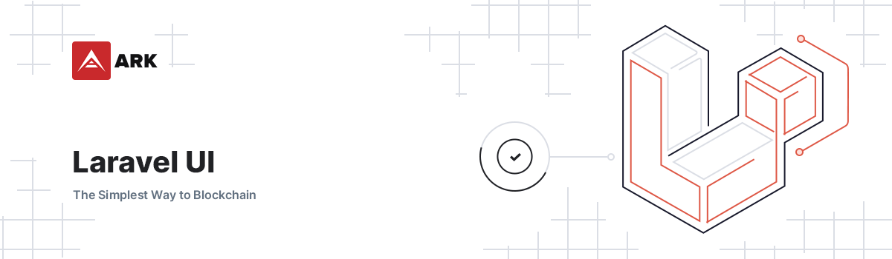

# Laravel UI

<p align="center">
    
</p>

> User-Interface Scaffolding for Laravel. Powered by TailwindCSS.

## Prerequisites

Since this package relies on a few 3rd party packages, you will need to have the following installed and configured in your project:

- [Alpinejs](https://github.com/alpinejs/alpine)
- [TailwindCSS](https://tailwindcss.com/)
- [TailwindUI](https://tailwindui.com/)
- [Livewire](https://laravel-livewire.com/)

## Installation

1. Require with composer: `composer require arkecosystem/ui`
2. Publish all the assets / views with `php artisan vendor:publish --provider="ARKEcosystem\UserInterface\UserInterfaceServiceProvider" --tag="css" --tag="fonts" --force`. If you need custom pagination, then also run `php artisan vendor:publish --provider="ARKEcosystem\UserInterface\UserInterfaceServiceProvider" --tag="pagination"`
3. Import the vendor css assets in your `app.css` file
4. Import the vendor `tailwind.config.js` file in your own tailwind config and build on top of that if you need additional changes
5. Use the components in your project with `<x-ark-component>`

**Protip**: instead of running step 3 manually, you can add the following to your `post-autoload-dump` property in `composer.json`:

```json
"post-autoload-dump": [
    "Illuminate\\Foundation\\ComposerScripts::postAutoloadDump",
    "@php artisan package:discover --ansi",
    "@php artisan vendor:publish --provider=\"ARKEcosystem\\UserInterface\\UserInterfaceServiceProvider\" --tag=\"css\" --tag=\"fonts\""
],
```

**Protip**: you can publish individual assets by using their tag, e.g. `--tag="css"`

**Protip 2**: in order to lazy-load icons, you will need to publish them by using their tag, e.g. `--tag=\"icons\"`

### Navbar / Avatar Component

The navigation bar makes use of [picasso](https://github.com/vechain/picasso) to generate a default avatar (in line with the Desktop Wallet). You will need to set this up in your project as follows:

1. Install dependencies

```bash
yarn add mersenne-twister ts-loader typescript
```

2. Add the following snippet to your layout:

```blade
<script src="{{ mix('js/picasso.js') }}" defer></script>
```

or to individual pages:

```blade
@push('scripts')
    <script src="{{ mix('js/picasso.js') }}" defer></script>
@endpush
```

3. Add to webpack mix

```js
.ts('resources/js/vendor/ark/picasso.ts', 'public/js')
```

4. Pass an `$identifier` value to the navbar component be used as seed for the generation of the image

### Clipboard

1. Add clipboard to Laravel Mix config

```js
.copy('resources/js/ark/vendor/clipboard.js', 'public/js/clipboard.js')
```

2. Publish the js assets if you haven't yet

```bash
php artisan vendor:publish --provider="ARKEcosystem\UserInterface\ServiceProvider" --tag="js"
```

3. Add clipboard to any pages that need it

```blade
@push('scripts')
    <script src="{{ mix('js/clipboard.js')}}"></script>
@endpush
```

4. Install `tippy.js`

```bash
yarn add tippy.js
```

5. Add the following snippet to your `resources/app.js`

```js
window.initClipboard = () => {
    tippy('.clipboard', {
        trigger: 'click',
        content: (reference) => reference.getAttribute('tooltip-content'),
        onShow(instance) {
            setTimeout(() => {
                instance.hide();
            }, 3000);
        },
    });
}
```

### Modals

1. Install `body-scroll-lock`

```bash
yarn add body-scroll-lock
```

2. Publish the js assets if you haven't yet

```bash
php artisan vendor:publish --provider="ARKEcosystem\UserInterface\UserInterfaceServiceProvider" --tag="js"
```

3. Import the modal script in your `resources/js/app.js` file

```js
import Modal from "./vendor/ark/modal.js";

window.Modal = Modal;
```

### Tooltips

1. Install `tippy.js`

```bash
yarn add tippy.js
```

2. Publish the js assets if you haven't yet

```bash
php artisan vendor:publish --provider="ARKEcosystem\UserInterface\ServiceProvider" --tag="js"
```

3. Add to webpack mix

```js
.js('resources/js/vendor/ark/tippy.js', 'public/js')
```

4. Add tippy to any pages that need it

```blade
@push('scripts')
    <script src="{{ mix('js/tippy.js')}}" defer></script>
@endpush
```

### Slider

1. Install `swiper`

```bash
yarn add -D swiper
```

2. Add swiper to Laravel Mix config

```js
.copy('node_modules/swiper/swiper-bundle.min.js', 'public/js/swiper.js')
```

3. Add swiper to any pages that need it

```blade
@push('scripts')
    <script src="{{ mix('js/swiper.js')}}"></script>
@endpush
```

4. Include swiper CSS

```css
@import "../../node_modules/swiper/swiper-bundle.min.css";
```

### Date Picker

1. Install `pikaday`

```bash
yarn add -D pikaday
```

2. Include pikaday CSS

```css
@import "../../node_modules/pikaday/css/pikaday.css";
@import '../../vendor/arkecosystem/ui/resources/assets/css/_pikaday.css';
```

### Notifications Indicator

1. Add this to your user migration table

```php
$table->timestamp('seen_notifications_at')->nullable();
```

2. Register the component in your LivewireServiceProvider file

```php
use Domain\Components\NotificationsIndicator;
...
Livewire::component('notifications-indicator', NotificationsIndicator::class);
```

### Prism Codeblock

1. Add prism js to Laravel webpack mix

```js
.js('resources/js/prism.js', 'public/js')
```

2. Publish the js & css assets if you haven't yet

```bash
php artisan vendor:publish --provider="ARKEcosystem\UserInterface\ServiceProvider" --tag="js" --tag="css"
```

3. Add prism to any pages that need it

```blade
@push('scripts')
    <script src="{{ mix('js/prism.js')}}"></script>
@endpush
```

4. Include prism CSS

```css
@import "../vendor/ark/_prism-theme.css";
```

5. Install `prism.js`

```bash
yarn add -D prism-themes prismjs
```

6. Add the following snippet to `resources/prism.js`

```js
import "../vendor/ark/prism";

document.addEventListener("DOMContentLoaded", () => {
    document
        .querySelectorAll("pre")
        .forEach((pre) => useHighlight(pre, { omitLineNumbers: false }));
});
```

### Error Pages

There are also default error pages you can use for your Laravel project

1. Run `php artisan vendor:publish --provider="ARKEcosystem\UserInterface\UserInterfaceServiceProvider" --tag="error-pages"`

2. Add the following snippet to your `menus.php` lang file:

```php
'error' => [
    '401' => '401 Unauthorized',
    '404' => '403 Forbidden',
    '404' => '404 Not Found',
    '419' => '419 Unauthorized',
    '429' => '429 Too Many Requests',
    '500' => '500 Internal Server Error',
    '503' => '503 Unavailable',
]
```

3. Please test if the pages work by manually going to a url that should throw an error

## Available Components

- `<x-ark-input>`
- `<x-ark-textarea>`
- `<x-ark-checkbox>`
- `<x-ark-radio>`
- `<x-ark-select>`
- `<x-ark-toggle>`
- `<x-ark-navbar>`
- `<x-ark-breadcrumbs>`
- `<x-ark-accordion>`
- `<x-ark-accordion-group>`
- `<x-ark-sidebar-link>`
- `<x-ark-alert>`
- `<x-ark-secondary-menu>`
- `<x-ark-clipboard>`

> See the [example file](EXAMPLES.md) for more in-depth usage examples

### Livewire Pagination Scroll

1. Add the following to `app.js` file:

```js
import '../vendor/ark/page-scroll';
```

2. Use the `HasPagination` trait on Livewire Components:

```php
use ARKEcosystem\UserInterface\Http\Livewire\Concerns\HasPagination;

class Articles {
    use HasPagination;
}
```

3. Add event trigger at the bottom of the component template:

```html
<div>
    ...

    <x-ark-pagination :results="$articles" class="mt-8" />

    <script>
        window.addEventListener('livewire:load', () => window.livewire.on('pageChanged', () => scrollToQuery('#article-list')));
    </script>
</div>
```

### Pagination

1. Publish the pagination assets

`php artisan vendor:publish --provider="ARKEcosystem\UserInterface\UserInterfaceServiceProvider" --tag="pagination"`

2. Add the following to the `app.js` file:

```js
import Pagination from "./vendor/ark/pagination";

window.Pagination = Pagination
```

3. All set, now you can use the pagination component

```html
<x-ark-pagination :results="$results"  />
```

### Footer

Add the following snippet to your `urls.php` lang file:

```php
'discord'  => 'https://discord.ark.io/',
'facebook' => 'https://facebook.ark.io/',
'github'   => 'https://github.com/ArkEcosystem',
'linkedin' => 'https://www.linkedin.com/company/ark-ecosystem',
'reddit'   => 'https://reddit.ark.io/',
'twitter'  => 'https://twitter.ark.io/',
'youtube'  => 'https://youtube.ark.io/',
```

## Available Styles

> It's advised to make use of the styles for generic components so we keep them similar throughout projects

- Buttons
- Tables
- Tabs

### In-progress

- more styles, and proper configuration to define where styles are published

## Blade Support

### Date Format

In `config/app.php` under `aliases`, add the following entry:

```
'DateFormat' => ARKEcosystem\UserInterface\Support\DateFormat::class,
```

### SVG Lazy-Loading Icons

In `config/app.php` under `providers`, add the following entry:

```
ARKEcosystem\UserInterface\Providers\SvgLazyServiceProvider::class,
```

This will initiate the `svgLazy` directive and allow you to load icons from the `arkecosystem/ui` package. For example:

```
@svgLazy('checkmark', 'w-5 h-5')
```

This will insert the following HTML:

```
<svg lazy="/icons/checkmark.svg" class="w-5 h-5" />
```

**Protip**: You will need lazy.js in order for this to work

## Development

If components require changes or if you want to create additional components, you can do so as follows:

### Vendor folder

This approach is recommended to test out smaller changes. You can publish the views by running `php artisan vendor:publish --tag=views`, and they will show up in the `views/vendor/ark` folder. From there you can edit them to your liking and your project will make use of these modified files. Make sure to later commit them to this repository when you have made your changes to keep the files throughout projects in sync.

### Components Folder

When you create a `views/components` folder, you can create new blade files inside it and they will automatically become available through `<x-your-component>` to be used in your project. This way you can create new components, test them, and then copy them to the `arkecosystem/ui` repo when finished.

Afterwards you can add new components to the local package and use it in your project for testing.

## Tailwind Configuration

There are a few tailwind configuration additions on which the components rely (e.g. colors and additional shadows) and are therefore expected to use the tailwind config in this repository as basis (you can import it and extend it further if needed).
