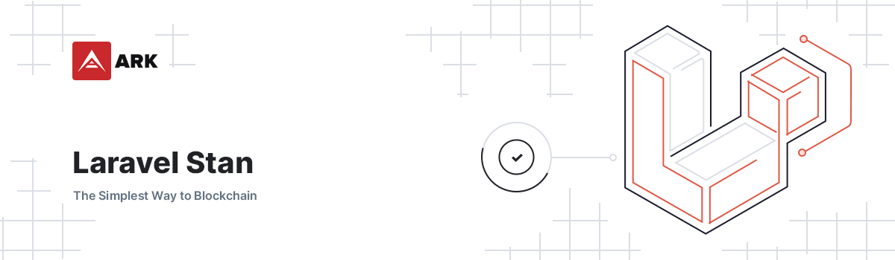

# Laravel Stan

<p align="center">
    
</p>

> Static Analysis & Testing for Laravel. Powered by PHPStan and Pest.

## Installation

1. Require with composer: `composer require arkecosystem/stan --dev`
2. Publish all configurations with `php artisan vendor:publish --provider="ARKEcosystem\Stan\StanServiceProvider" --tag=config`.
3. Publish all workflows with `php artisan vendor:publish --provider="ARKEcosystem\Stan\StanServiceProvider" --tag=workflows`.
4. Start tweaking the configurations as needed for your project.

## File Analysis

When working on larger projects it can happen that you move files on a regular basis and forget to update a reference. We use [graham-campbell/analyzer](https://github.com/GrahamCampbell/Analyzer) to avoid this. Create the file `tests/Analysis/AnalysisTest.php` and the test suite will fail if any references don't match a file.

```php
<?php

declare(strict_types=1);

namespace Tests\Analysis;

use GrahamCampbell\Analyzer\AnalysisTrait;
use PHPUnit\Framework\TestCase;

final class AnalysisTest extends TestCase
{
    use AnalysisTrait;

    public function getPaths(): array
    {
        return [
            __DIR__.'/../../app',
        ];
    }

    public function getIgnored(): array
    {
        return ['Laravel\Scout\Builder'];
    }
}
```
