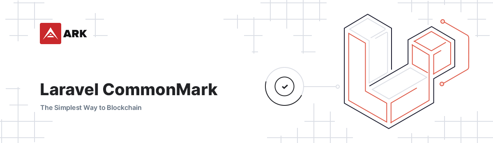

# Laravel CommonMark

<p align="center">
    
</p>

> CommonMark for Laravel. Powered by league/commonmark.

## Installation

1. Require with composer: `composer require arkecosystem/commonmark`
2. Publish all the assets / views with `php artisan vendor:publish --provider="ARKEcosystem\CommonMark\CommonMarkServiceProvider" --tag=config`.
3. Disable auto-discovery for all fortify packages. This step is required so that we can control the loading order of `graham-campbell/markdown` and `arkecosystem/commonmark`.

```json
"extra": {
    "laravel": {
        "dont-discover": ["arkecosystem/commonmark", "graham-campbell/markdown"]
    }
},
```

4. Register the service providers in this exact order. This will ensure that our package can overwrite any bindings that `graham-campbell/markdown` created.

```php
GrahamCampbell\Markdown\MarkdownServiceProvider::class,
ARKEcosystem\CommonMark\CommonMarkServiceProvider::class,
```

## Usage

This package provides parsing and rendering for CommonMark. All the specifications and examples can be seen at https://commonmark.org/. There are a few custom elements that can be used to embed third-party content.

### Embed SimpleCast

```markdown

```

### Embed Twitter

```markdown

```

### Embed YouTube

```markdown

```
