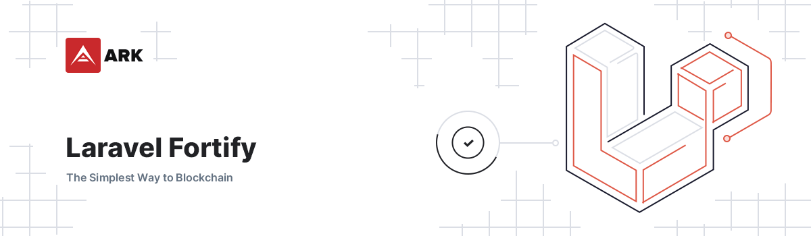

# Laravel Fortify

<p align="center">
    
</p>

> Authentication Scaffolding for Laravel. Powered by Laravel Fortify.

## Installation

1. Require with composer: `composer require arkecosystem/fortify`
2. Publish all the assets / views with `php artisan vendor:publish --provider="ARKEcosystem\Fortify\FortifyServiceProvider" --tag=config --tag=images`.
3. Disable auto-discovery for all fortify packages. This step is required so that we can control the loading order of `laravel/fortify` and `arkecosystem/fortify`.

```json
"extra": {
    "laravel": {
        "dont-discover": ["arkecosystem/fortify", "laravel/fortify"]
    }
},
```

4. Required Image

Projects require an image to be provided: `resources/images/auth/verify-email.svg`

This is omitted from fortify to prevent it being overwritten, but allows for it to be customised per project.

In the future, a config file may be a better route if there are multiple instances of images being required.

5. Register the service providers in this exact order. This will ensure that our package can overwrite any bindings that `laravel/fortify` created.

```php
Laravel\Fortify\FortifyServiceProvider::class,
ARKEcosystem\Fortify\FortifyServiceProvider::class,
```

6. Enable or disable the login/register with username or email by using the `username_alt` setting in the `config/fortify.php` file

```php
<?php

return [
    // ...
    'username_alt' => 'username',
    // Or set that setting to `null` so the user can only login/register with email:
    // 'username_alt' => null,
    // ...
];
```

**Note:** If you use the `username_alt` setting, you need to ensure that your users table has that column.

**Note:** Currently fortify is intended to be used with `'username' => 'email'` in your config, as it expect the `email` property to be set when creating a new user.

7. Register databags in your `AppServiceProvider` that are used by the auth pages

```php
use Konceiver\DataBags\DataBag;

...

public function boot()
{
    ...

    $this->registerDataBags();
}

private function registerDataBags(): void
{
    DataBag::register('fortify-content', [
        'register' => [
            'pageTitle' => '',
            'title' => '',
            'description' => '',
        ],
        'login' => [
            'pageTitle' => '',
            'title' => '',
            'description' => '',
            // Optional
            // 'signupLink'  => '',
        ],
        'password' => [
            'reset' => [
                'pageTitle' => '',
            ],
            'request' => [
                'pageTitle' => '',
            ],
        ],
        'verification' => [
            'notice' => [
                'pageTitle' => '',
            ],
            'verify' => [
                'pageTitle' => '',
            ],
            'send' => [
                'pageTitle' => '',
            ],
        ],
        'two-factor' => [
            'login' => [
                'pageTitle' => '',
            ],
        ],
    ]);
}
```

### Two Factor Authentication

> Under the hood we use [**Pragmarx Google2fa-laravel**](https://github.com/antonioribeiro/google2fa-laravel#readme) package.  
> 
> For custom configuration like [generating QR-Code using SVG render](https://github.com/antonioribeiro/google2fa-laravel#qrcode-backend) instead of a default Imagemagick, 
> you can [publish the default configuration](https://github.com/antonioribeiro/google2fa-laravel#publish-the-config-file) and adjust it as per your needs.

1. Add file download JS to Mix file

```js
.copy('vendor/arkecosystem/ui/resources/assets/js/file-download.js', 'public/js/file-download.js')
```

2. Include file on any page that needs it (e.g. Account Settings)

```blade
@push('scripts')
    <script src="{{ mix('js/file-download.js')}}"></script>
@endpush
```

3. Build assets

```bash
yarn prod
```

### Required images

#### Password Confirmation modal

The password confirmation modal requires an image to be added to to the path `resources/images/auth/confirm-password.svg` for the projects that use it.
