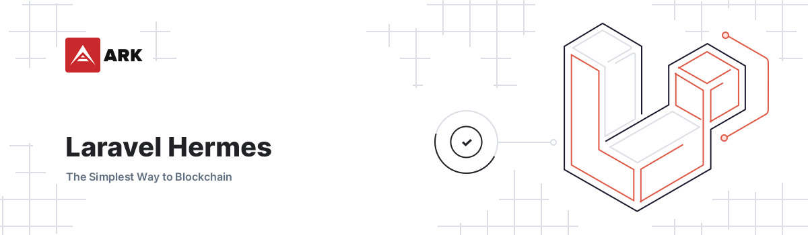

# Laravel Hermes

    

> Notifications and accompanying UI for Laravel.

## Installation

1. Require with composer: `composer require arkecosystem/hermes`
2. Publish the migrations with `php artisan vendor:publish --tag=hermes-migrations`
